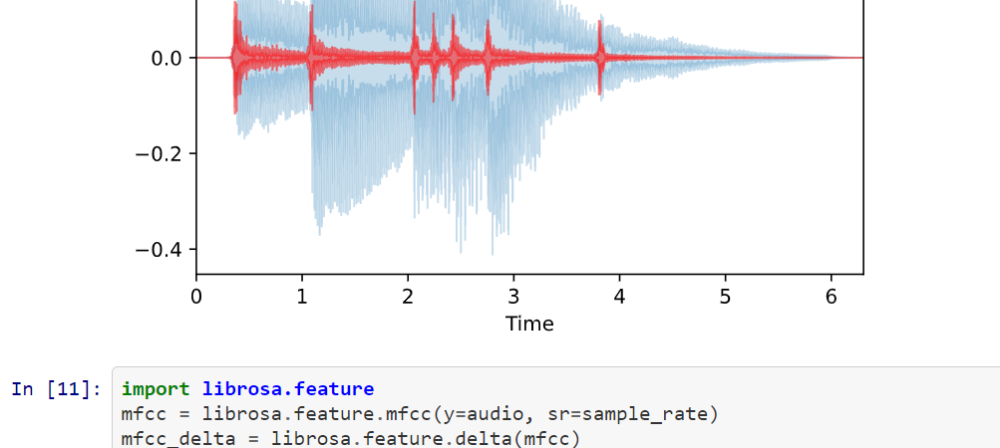

The idea is to take advantage of the latest advances of Machine learning and Audio processing to create innovative applications.

## Real time Audio
Smart applications are ones that instantly react to the user either in collaborative interactive way or in assistive tracking mode.
Therefore real-time processing is a mandatory aspect for such applications

## Capture
From Audio capture with I2S microphone arrays connected in microcontrollers to any sort of user input capture that is to be used to impact sound generation

## Processing
Requires hardware acceleration as all the flow is expected to run on the fly. A part of the samples relates to the analysis and learning though, that's where Python is used.

## Microcontroller
* STM32 based on ARM-M4 with USB connections
* ESP32 (wifi / BT)
* nRF52 (custom RF / BT)

# Repositories

## [pystream](https://github.com/SoundHacking/pystream)
* List audio devices
* Test Audio input and output
* connect inputs to outputs
* process the live stream between input and output

### dependencies

* matplotlib
* numpy
* [sounddevice](https://python-sounddevice.readthedocs.io/)

## [see sound](https://github.com/SoundHacking/see_sound)
* a web app framework to see the sound in different forms
* No display available yet
* Playing sound with html5 [web Audio API](https://www.w3.org/TR/webaudio/)
* [Live demo](https://soundhacking.github.io/see_sound/)

## [librosa_demo](https://github.com/SoundHacking/librosa_demo)
* Jupyter notebooks to showcase librosa functions

